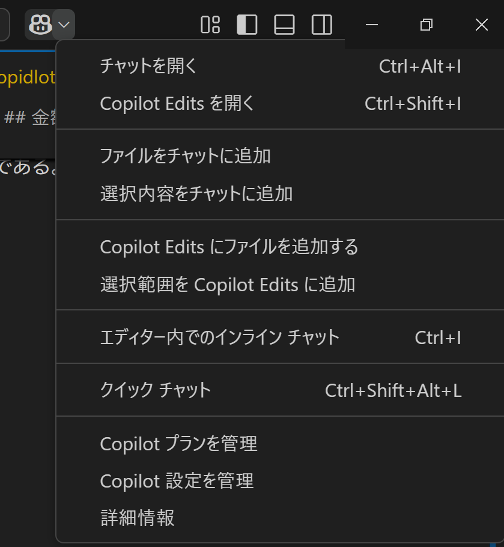

# Copidlotについて
作成者：木内　和也
作成日：2022/8/1
更新日：2025/1/22

---

# 概要
GitHubが提供している人工知能（AI）技術を活用したコーディング支援機能。
コメントや関数のシグネチャーから文脈を読み取り、プログラマーがこれから書こうとする実装を予測して、それを代わりに書いてくれる。(日本語も対応している。)
[ペアプログラミング](https://www.geekly.co.jp/column/cat-technology/1219_008/)を行う感じで、人間ナビゲーター、AIがドライバーの役割を行うイメージである。

## 対応言語について
Python、JavaScript、TypeScript、Ruby、Java、Go
など様々な言語に対応。

## 使用環境について
基本的には拡張機能を導入するだけで簡単に利用可能。
- Visual Studio Code
- Visual Studio
- Neovim
- JetBrains製の各種統合開発環境（IDE）

## 金額について(2022/8/1版)
- 一般向け
  - 月額：10\$
  - 年額：100\$

```注釈
※企業向けははだ存在しない。(今年の後半には企業への提供も開始)
※試用期間は60日
※現在(8月1日時点)では、2022年8月22日まで無料で試用可能
```

## GitHub Copilot 料金プラン(2025/1/22版)
- 2025/1/22時点では無料版が提供されている。

### Freeプラン
- **対象:** GitHub Copilotを初めて利用する開発者
- **特徴:** 完結数2,000回、チャットリクエスト月50回まで
- **料金:** 無料

### Proプラン
- **対象:** GitHub Copilotを無制限に使いたい開発者
- **特徴:** 無制限のアクセス、最初の30日間無料
- **料金:** 10ドル/月/ユーザー

### Businessプラン
- **対象:** ワークフローを加速させたいチーム
- **特徴:** GitHub Copilotでワークフローを加速
- **料金:** 19ドル/月/ユーザー

### Enterpriseプラン
- **対象:** 完全なカスタマイズを求める組織
- **特徴:** GitHub Copilotを完全にカスタマイズ
- **料金:** 39ドル/月/ユーザー

### **その他**
- **学生、教師、オープンソースプロジェクトのメンテナー:** Proプランを無料で利用できます。
- **VS Codeユーザー:** VS Codeをすでに利用している場合は、そこから直接プランを選択できます。

- **詳細については、GitHubの公式サイトをご確認ください。**

- VisualStudioCodeにgithubのアカウントを連携するだけで無料版の利用が可能
    

# 参考サイト
- [公式サイト](https://github.com/features/copilot)
- [公式ブログ](https://github.blog/jp/2022-06-22-github-copilot-is-generally-available-to-all-developers/)