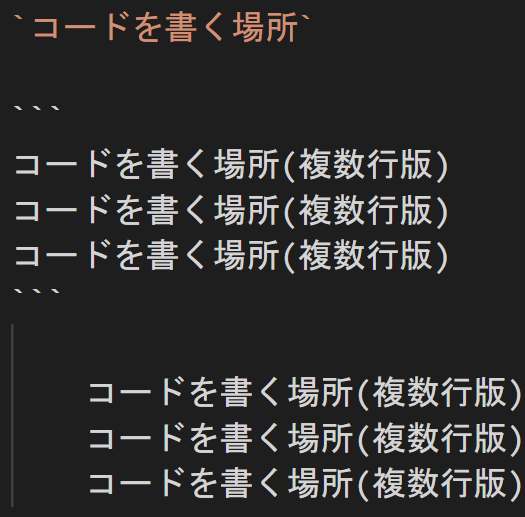

# Markdownについて
作成者：木内　和也
作成日：2022/7/12

---

# Markdown記法について

---


- Markdownとは、文書を記述するための軽量マークアップ言語のひとつである。
[参考](https://ja.wikipedia.org/wiki/Markdown)
- 今回はVisual Studio Codeを利用している。

---

## 利用してみての所感
- 覚えやすく、メモを作成した上で、簡単に資料へ変換、作成に利用できる。
- 凝ったことをやろうとすると、HTML/CSSの知識が必要。
- marpを利用すればプレゼン資料の作成も可能。
- Mermaidを利用すれば、シーケンス図、フローチャート図などの作成も可能。
- BackLogやGitHub、Qiitaなどにアップロードするだけでそのまま使えるサービスが存在する。（カスタマイズされた使い方も存在する。）

---

## Markdownから変換可能先

簡単にエクスポートが可能
<div style="text-align:left;">

- pdf
- html
- pptx
- png
- jpg

</div>

---

# WEBへの展開
PDF化やHTML化が出来るので、
Webへの展開も簡単にできる。

---

<!-- footer: "PDFの活用" -->
# PDFの活用

```https://drive.google.com/uc?id=<ファイルID>```
- この形式で*Google Drive*のファイルを直リンクで扱うことが出来る。
`※2022/07/12時点では、pdfや画像で直リンク可能。`

---

- PDF化ができれば、
embedやiframeを利用すれば、WEBに公開することが出来る。

---

<!-- footer: "Markdownの使い方" -->
# Markdownの使い方
ここから先はMarkdownの基本的な使い方の説明

---

## 見出し

- `# `を使う。
<span style="font-size:30px;">(半角スペースを入れ忘れないように気をつける。)</span>

- 6段階まで指定可能

記述方法
```
# １段階目
## 2段階目
### 3段階目
#### 4段階目
##### 5段階目
###### 6段階目
```

---

出力結果

# １段階目
## 2段階目
### 3段階目
#### 4段階目

---

## リスト表示
- `- `,`+ `,`* `を使う。
<span style="font-size:30px;">(半角スペースを入れ忘れないように気をつける。)</span>
- 前にタブを入れることで7段階まで指定可能

記述方法
```
- 1
    - 2
        - 3
            - 4
                - 5
                    - 6
                        - 7
```

---

出力結果
- 1
    - 2
        - 3
            - 4
                - 5
                    - 6
                        - 7


---
## 番号付きリスト表示
- `1. `を使う。基本的には数字は1を入れる。
<span style="font-size:30px;">(半角スペースを入れ忘れないように気をつける。)</span>
- 前にタブを入れることで2段階まで指定可能

記述方法
```
1. 1
    1. 2
    1. 3
1. 1
    1. 2
    1. 3
```

---

出力結果
1. 1
    1. 2
    1. 3
    1. 4
1. 1
    1. 2
    1. 3
    1. 4

---

## 引用
- 引用していますを示すことができる。
- 前にタブを入れることで2段階まで指定可能
- `> `を追加することで無限段階ある。
<span style="font-size:30px;">(半角スペースを入れ忘れないように気をつける。)</span>

記述方法
```
> 引用例文
>> を書き込んでいます。
>>> どうでしょうか？
```

---

出力結果
> 引用例文
>> を書き込んでいます。
>>> どうでしょうか？

---

## コード記法

- `で囲む(バッククォート)
- `を３つで複数行に対応
- 複数行に関しては行毎にTabまたは4半角スペースでも使える。

---

記述方法


---

出力結果
`コードを書く場所`


```
コードを書く場所(複数行版)
コードを書く場所(複数行版)
コードを書く場所(複数行版)
```

    コードを書く場所(複数行版)
    コードを書く場所(複数行版)
    コードを書く場所(複数行版)

---

## 強調1

- `*`で囲む
- Marp利用時、デフォルトのデザインで日本語を強調した場合、変化がありません。(強調時のフォント関係)

記述方法
```
*強調内容*
```

---

出力結果
強調非対象
*強調内容*
abcdefg強調非対象
*abcdefg*

---

## 強調2

- `**`で囲む

記述方法
```
**強調内容**
```

---

出力結果
強調非対象
**強調内容**
abcdefg強調非対象
**abcdefg**

---

## 強調3

- `***`で囲む
- Marp利用時、デフォルトのデザインで日本語を強調した場合、強調2と比べて変化がありません。(強調時のフォント関係)

記述方法
```
***強調内容***
```

---

## 訂正線

記述方法
~~あああ~~
出力結果
~~あああ~~

---

出力結果
強調非対象
***強調内容***
abcdefg強調非対象
***abcdefg***

---

## 改ページ(水平線)
- `---`や`***`を単体で書く
    正しく動作させるコツとしては、上下に空白行を入れる。
- Marpを使っている場合は改ページ
- Marpを使っていない場合は水平線

---

記述方法
```
---

```

---

出力結果

---

---

## リンク
`[表示内容](URL)`の形式で記述

記述方法
```
[Google](https://www.google.com)
```

出力結果
[Google](https://www.google.com)

---

## 定義参照リンク
- `[表示内容][URLの定義名]`の形式で記述
- URLの部分を予め定義したものに置き換える
- 定義方法は`[定義名]: URL`
    正しく動作させるコツとしては、上下に空白行を入れる。

記述例
```
[Google][Google]
```

---

出力結果
[Google][Google]

定義方法

```
[Google]: https://www.google.com
```

[Google]: https://www.google.com

---

## 画像

記述方法

```

```

出力結果


---

## 表

記述方法
~~~
| Left align | Right align | Center align |
|:-----------|------------:|:------------:|
| This       | This        | This         |
| column     | column      | column       |
| will       | will        | will         |
| be         | be          | be           |
| left       | right       | center       |
| aligned    | aligned     | aligned      |
~~~

---

出力結果
| Left align | Right align | Center align |
|:-----------|------------:|:------------:|
| This       | This        | This         |
| column     | column      | column       |
| will       | will        | will         |
| be         | be          | be           |
| left       | right       | center       |
| aligned    | aligned     | aligned      |

---

## 折りたたみ

記述方法
```
<details><summary>サンプルコード</summary>
コード
ABCD
EFGH
</details>
```

---

出力結果
<details><summary>サンプルコード</summary>
コード
ABCD
EFGH
</details>

---
## 説明リスト

- HTMLと同じ書き方で実装可能

記述方法
```
<dl>
  <dt>リンゴ</dt>
  <dd>赤いフルーツ</dd>
  <dt>オレンジ</dt>
  <dd>橙色のフルーツ</dd>
</dl>
```

---

出力結果
<dl>
  <dt>リンゴ</dt>
  <dd>赤いフルーツ</dd>
  <dt>オレンジ</dt>
  <dd>橙色のフルーツ</dd>
</dl>

---

## 絵文字の埋込

記述方法
```
:smile:
```
出力結果
:smile:
- 絵文字リスト：[リンク](https://www.webfx.com/tools/emoji-cheat-sheet/)

---

# 参考サイト

- [Markdown記法 チートシート](https://qiita.com/Qiita/items/c686397e4a0f4f11683d)
- [【VS Code + Marp】Markdownから爆速・自由自在なデザインで、プレゼンスライドを作る](https://qiita.com/tomo_makes/items/aafae4021986553ae1d8)
- [絵文字リスト](https://www.webfx.com/tools/emoji-cheat-sheet/)
- [VISUAL STUDIO CODE で MERMAID をプレビューする方法](https://usefuledge.com/vscodemermaidsupport.html)
- [Markdown記法 チートシート](https://qiita.com/Qiita/items/c686397e4a0f4f11683d)
